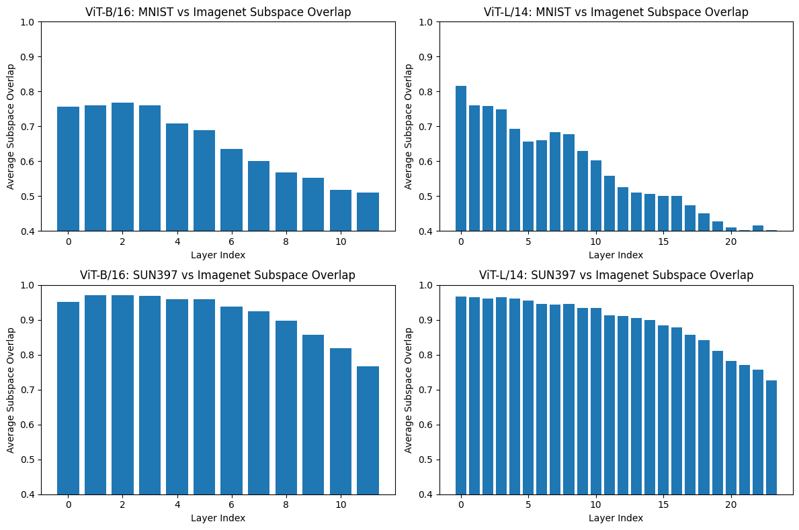

# TAFAL

This repository contains the code for **TAFAL**.  
It is anonymized for double-blind NeurIPS review.

## Comparison of Model Merging Capabilities

| **Capability** | **RegMean** | **CAT** | **TA / ATLAS / TALOS** | **TaFaL (Ours)** |
|:---|:---:|:---:|:---:|:---:|
| Task Addition | ✅ | ✅ | ✅ | ✅ |
| Task Negation | ❌ | ❌ | ✅ | ✅ |
| Mixed Addition + Negation | ❌ | ❌ | ❌ | ✅ |
| LLM Alignment (Chosen + Rejected) | ❌ | ❌ | ❌ | ✅ |
| Toxicity Reduction (Negating Toxic Behavior) | ❌ | ❌ | ✅ | ✅ |
| Training-Free | ✅ | ✅ | ❌ (ATLAS/TauJP require training) | ✅ |
| Closed-Form Solution | ✅ | ✅ | ❌ | ✅ |

## Layerwise Subspace Overlap


## Comparison with TIES and CAT Merging

| Model | Method | Cars | DTD | EuroSAT | GTSRB | MNIST | RESISC45 | SVHN | SUN397 | Avg. | Avg. Norm. |
|:------|:-------|------:|------:|---------:|-------:|-------:|----------:|------:|--------:|------:|-----------:|
| ViT-B/16 | CAT | 70.66 | 60.64 | 84.30 | 74.84 | 97.83 | 83.24 | 82.60 | 67.53 | **77.70** | **84.28** |
| | TIES | 71.32 | 70.74 | 79.96 | 87.24 | 97.75 | 88.24 | 83.25 | 68.61 | **80.89** | **87.83** |
| | **TaFaL (Ours)** | **82.31** | **74.95** | **97.59** | **94.55** | **98.91** | **92.06** | **86.21** | **74.47** | **87.63** | **92.36** |
| ViT-B/32 | CAT | 65.22 | 59.31 | 83.22 | 67.66 | 96.86 | 80.44 | 79.89 | 66.18 | **74.85** | **82.72** |
| | TIES | 62.88 | 58.78 | 80.48 | 67.74 | 96.95 | 77.56 | 80.24 | 64.65 | **73.66** | **81.44** |
| | **TaFaL (Ours)** | **73.41** | **74.79** | **97.11** | **91.25** | **99.13** | **91.88** | 79.52 | **74.83** | **85.24** | **90.11** |
| ViT-L/14 | CAT | 84.44 | 73.94 | 93.33 | 93.98 | 98.73 | 87.24 | 81.85 | 73.41 | **85.87** | **91.17** |
| | TIES | 85.29 | 73.40 | 87.85 | 97.66 | 98.97 | 84.36 | 79.26 | 73.82 | **85.08** | **—** |
| | **TaFaL (Ours)** | **89.08** | **79.89** | **99.04** | **96.39** | **99.57** | **94.43** | **97.56** | **77.32** | **91.66** | **95.53** |

## Wall clock and storage for Llama2-7b (merged layerwise at inference)  

Method                  Wall Clock (s)   Peak Layer Storage
-----------------------------------------------------------
TaFaL (Full XXᵀ)             1200             7.1 GB
TaFaL (Rank-64 SVD)          1260             111 MB
TaFaL (Rank-32 SVD)          1235              55 MB

## Environment Setup

### Requirements
- Python 3.10  
- CUDA 12.x (for GPU experiments)  
- NVIDIA driver compatible with the PyTorch CUDA build  

### Create Conda Environment
```bash
conda create -n tafal python=3.10 -y
conda activate tafal
conda install pip -y
```

### Install PyTorch (GPU)
```bash
conda install pytorch torchvision pytorch-cuda=12.1 -c pytorch -c nvidia
```

### Install Dependencies
```bash
pip install -r requirements.txt
```

### Verify Installation
```bash
python -c "import torch; print(torch.cuda.is_available())"
```

## Notes
- All dependencies are specified in `requirements.txt`.
- This repository will be de-anonymized upon acceptance.
